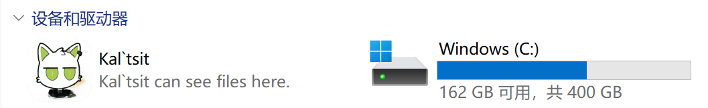
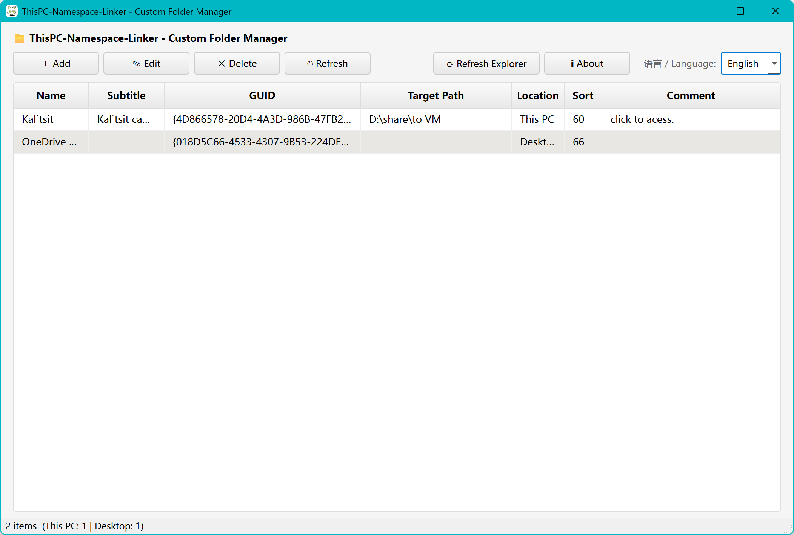
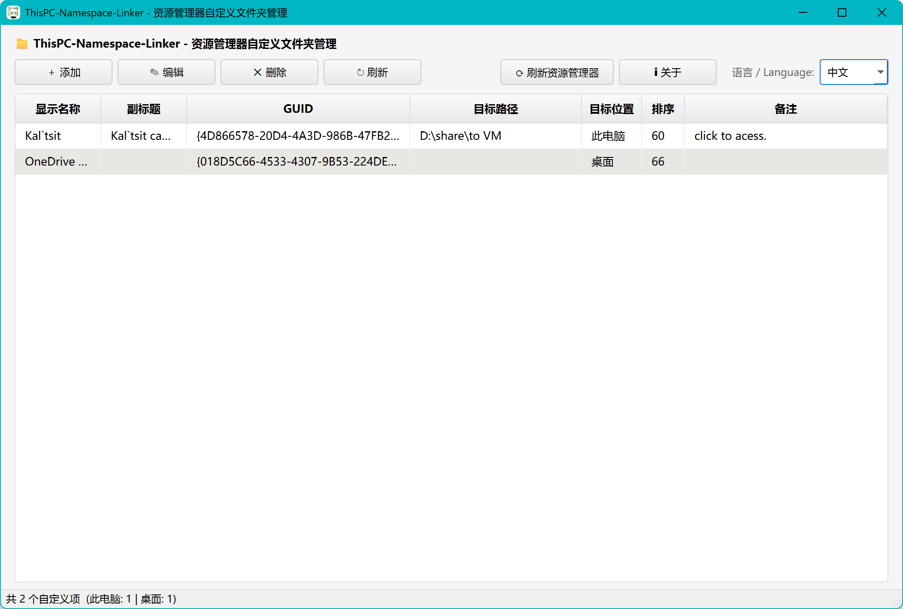
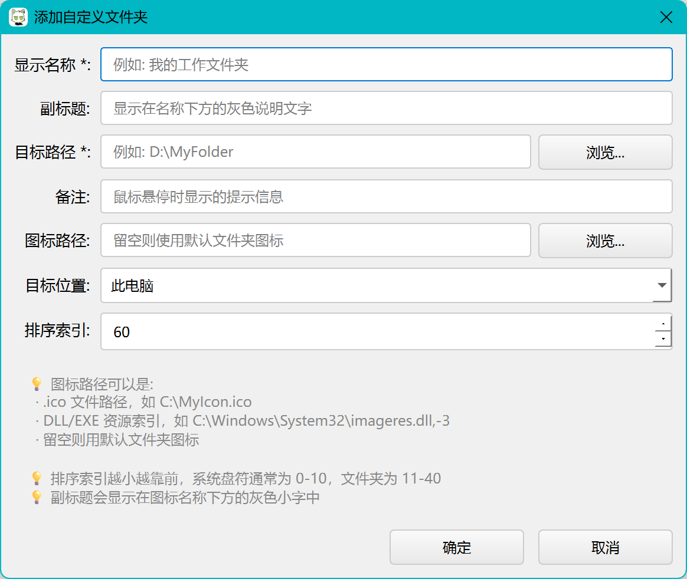

<p align="center">
  
</p>

<h1 align="center">ThisPC‑Namespace‑Linker</h1>

<p align="center">
  <strong>Add custom folder shortcuts to "This PC" in Windows File Explorer</strong>
  <br>
  <strong>📌 站在"此电脑"里看你的常用文件夹</strong>
</p>

<p align="center">
  <a href="LICENSE"></a>
  <a href="#下载">中文版</a> •
  <a href="#screenshots">Screenshots</a> •
  <a href="#download">Download</a> •
  <a href="#usage">Usage</a> •
  <a href="#build">Build</a>
</p>

<p align="center">
  <b>中文 · English · Portable · No install needed</b>
</p>

---

## Screenshots






## What is this?

A lightweight Windows utility that lets you **pin custom folder shortcuts directly into the "This PC" view in File Explorer** — right next to your C: drive, D: drive, and USB devices.

Ever get tired of navigating through layers of folders every day? This tool puts your frequently-used directories where you can always find them.

## Features

- ✅ **Pin folders** to "This PC" or Desktop namespace
- ✅ **Customize appearance** — display name, subtitle (gray text below name), icon, tooltip
- ✅ **Sort control** — lower values appear first (drives: 0–10, folders: 11–40)
- ✅ **Edit & delete** entries from a simple GUI
- ✅ **One-click refresh** — no need to restart Explorer
- ✅ **Bilingual UI** — 中文 / English, switch anytime
- ✅ **Portable single-file exe** — download and run, no installation, no Python required

## Download

Grab the latest release from the [Releases page](https://github.com/xuer-L/ThisPC-Namespace-Linker/releases):

> **`ThisPC‑Namespace‑Linker.exe`** — standalone, no dependencies. Run it and go.

## Usage

1. **Run the exe** (right-click → Run as administrator)
2. Click **＋ Add**
3. Fill in the form:
   - **Display Name** — required, shows up in Explorer
   - **Target Path** — required, the folder you want to link to
   - Subtitle, Icon, Tooltip, Sort Order — all optional
4. Click **OK**
5. Open "This PC" in Explorer — your folder is right there

To remove: select it in the list → click **✕ Delete**.

> ⚠️ **Why admin rights?** The tool writes to HKCU registry (`Software\Classes\CLSID` and namespace keys). These are per-user, but some namespace locations require elevation on certain Windows versions.

## FAQ

**Q: Is it safe?**
> Yes. It only writes to HKCU — your user-level registry. Nothing system-wide. The source is fully open so you can verify.

**Q: Does it collect any data?**
> No. Zero telemetry, no analytics, no network calls. Everything stays local.

**Q: Can I use a custom icon?**
> Yes — `.ico` files, or DLL/EXE resource indices like `imageres.dll,-3`.

**Q: Works on Windows 10 / 11?**
> Yes. Tested on both.

## Build

Requirements: **Python 3.10+** and **Windows**.

```bash
git clone https://github.com/xuer-L/ThisPC-Namespace-Linker.git
cd ThisPC-Namespace-Linker
pip install -r requirements.txt

# Run directly (dev)
python AddVirtualDisk.py

# Build portable exe
pip install pyinstaller
pyinstaller ThisPC-Namespace-Linker.spec
# Output: dist/ThisPC-Namespace-Linker.exe
```

## Project Structure

```
ThisPC-Namespace-Linker/
├── AddVirtualDisk.py            # Core logic — registry operations
├── AddVirtualDisk_ui.py         # PySide6 GUI
├── i18n.py                      # zh/en language strings
├── ThisPC-Namespace-Linker.spec # PyInstaller config
├── logo.ico                     # App icon
├── screenshots/                 # Screenshots for README
├── requirements.txt
├── README.md
└── LICENSE                      # GPL-3.0
```

## License

[GNU General Public License v3.0](LICENSE)

Built by [Xuer](https://xuer.space) · Code with Deepseek

---

# 中文版

<p align="center">
  <strong>ThisPC‑Namespace‑Linker — 在"此电脑"中添加自定义文件夹</strong>
</p>

## 这是什么？

一个轻量 Windows 小工具，让你能在**资源管理器的"此电脑"视图下添加自定义文件夹快捷入口**——和 C 盘、D 盘、U 盘出现在同一个位置。

不用再一层层翻目录树，常用文件夹直接钉在眼前。

## 截图






## 功能

- ✅ 在"此电脑"或桌面添加自定义文件夹图标
- ✅ 自定义显示名称、副标题（名字下方的灰色小字）、图标、鼠标悬停提示
- ✅ 排序控制——数值越小越靠前
- ✅ 一个界面管理所有已添加的项
- ✅ 一键刷新资源管理器，不用重启
- ✅ 中英文随时切换
- ✅ 单文件 exe，下载即用，无需 Python

## 下载

从 [Releases 页面](https://github.com/xuer-L/ThisPC-Namespace-Linker/releases) 下载最新版：

> **`ThisPC‑Namespace‑Linker.exe`** — 独立 exe，下载后直接运行。

## 使用方法

1. **右键以管理员身份运行** exe
2. 点击 **＋ 添加**
3. 填写：
   - **显示名称**（必填）—— 资源管理器中显示的名字
   - **目标路径**（必填）—— 你要链接的文件夹
   - 副标题、图标、备注、排序 —— 均可选
4. 点击确定
5. 打开"此电脑"——你的文件夹就在那里

删除：选中 → 点击 **✕ 删除**

> ⚠️ **为什么要管理员权限？** 工具会写入当前用户的注册表（`HKCU\Software\Classes\CLSID` 和 NameSpace 键）。这些都是用户级操作，但某些 Windows 版本的命名空间位置需要提权。

## 常见问题

**问：安全吗？**
> 只写 HKCU（当前用户注册表），不碰系统级 HKLM。源码全公开，可自行审查。

**问：会收集数据吗？**
> 不会。没有统计，没有遥测，没有任何网络请求。所有数据在本地。

**问：能用自定义图标吗？**
> 可以。支持 `.ico` 文件，也支持 DLL/EXE 资源索引，例如 `imageres.dll,-3`。

**问：支持 Windows 10 和 11 吗？**
> 都支持。

## 从源码构建

要求：**Python 3.10+** 和 Windows。

```bash
git clone https://github.com/xuer-L/ThisPC-Namespace-Linker.git
cd ThisPC-Namespace-Linker
pip install -r requirements.txt

# 直接运行（开发）
python AddVirtualDisk.py

# 打包单文件 exe
pip install pyinstaller
pyinstaller ThisPC-Namespace-Linker.spec
# 生成: dist/ThisPC-Namespace-Linker.exe
```

## 项目结构

```
ThisPC-Namespace-Linker/
├── AddVirtualDisk.py            # 核心逻辑——注册表操作
├── AddVirtualDisk_ui.py         # PySide6 图形界面
├── i18n.py                      # 中英文语言包
├── ThisPC-Namespace-Linker.spec # PyInstaller 打包配置
├── logo.ico                     # 图标
├── screenshots/                 # 截图素材
├── requirements.txt
├── README.md
└── LICENSE                      # GPL-3.0
```

## 许可证

[GNU General Public License v3.0](LICENSE)

Built by [Xuer](https://xuer.space) · Code with Deepseek
